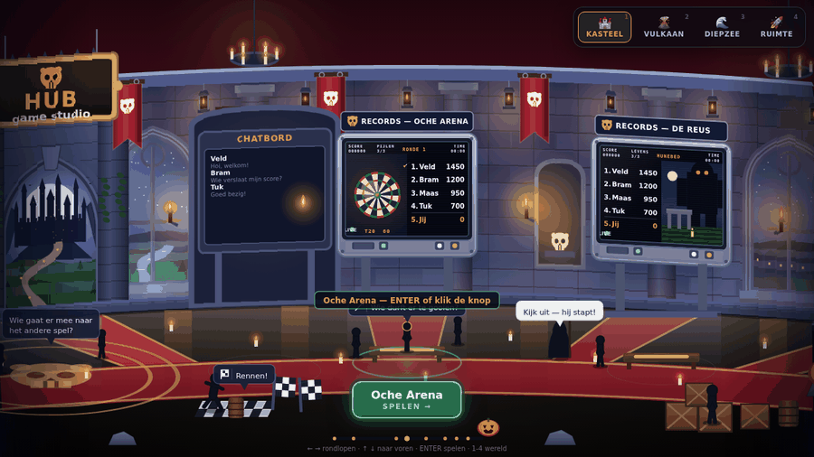
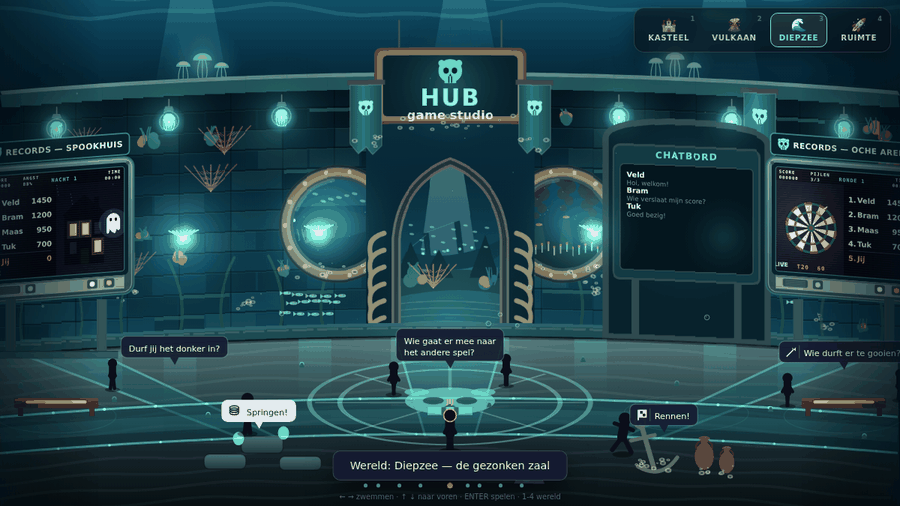

# HUB Game Studio

Een speelbare hub in de browser: je loopt rond in een ronde zaal met zes spellen,
een scorebord en een chat. Dezelfde zaal bestaat in vier werelden — kasteel, vulkaan,
diepzee en ruimte — en je wisselt ertussen met de knoppen rechtsboven of de toetsen 1-4.

Alles zit in één HTML-bestand. Geen build nodig om te spelen, geen installatie.





## Spelen

Open `index.html` — dubbelklikken is genoeg.

| Toets | Wat het doet |
|---|---|
| ← → | rondlopen (de zaal draait mee bij de rand) |
| ↑ ↓ | naar voren en achteren |
| Enter | spelen, of een bord openen |
| 1 – 4 | van wereld wisselen |
| Esc | terug naar de hub |

## De zes spellen

| Spel | Wat je doet | Telt in |
|---|---|---|
| Torenklim | klim omhoog voor de lava je inhaalt | punten |
| Spinnennest | ontwijk de spinnen op de boerderij | punten |
| Spookhuis | jaag de bewoners de stuipen op het lijf | keer schrik |
| Oche Arena | darten, drie pijlen per beurt | punten |
| De Reus | blijf uit de voeten van de reus | meters |
| De Hal | overleef zo lang mogelijk | seconden |

Elk spel draait in een eigen frame binnen de pagina en geeft zijn score door aan de hub.
De originelen staan in `src/games/`.

## Scorebord en chat

Het scorebord hangt tegenover de poort, het chatbord in de wand. Beide zijn ook als
volledig scherm te openen.

- **Scorebord** met tabbladen vandaag / deze week / deze maand / aller tijden, en een
  filter per spel.
- **Chat** met snelle zinnen en vrij typen. Tik op een naam om je bericht aan iemand te
  richten — alle gesprekken blijven openbaar en staan op het chatbord in de zaal.
- **Woordfilter** voor Nederlands en Engels, bestand tegen `k4nker`, `shiiiit` en
  `b i t c h`. Scheldwoorden worden vervangen door een grappig woord.

Zonder server werkt dit allemaal lokaal: scores blijven in je eigen browser en er lopen
zes computerspelers in de chat rond.

## Samen spelen

Met een gratis Firebase-project delen alle spelers dezelfde chat en hetzelfde scorebord,
en zie je wie er nu online is.

1. Volg **[docs/firebase-setup.md](docs/firebase-setup.md)** — een kwartiertje.
2. Vul je gegevens in **`firebase-config.js`** in.
3. Plak **`firestore.rules`** in de Firestore-console bij *Rules*.

De sleutel in `firebase-config.js` hoort publiek te zijn; hij staat in elke
Firebase-website. Je data wordt beschermd door de regels, niet door die sleutel.

## Online zetten

Zet GitHub Pages aan onder **Settings → Pages → Branch: `main`, map `/ (root)`**.
Na een minuut staat de hub op `https://<gebruikersnaam>.github.io/<repo>/`.

Een alternatief zonder repo: sleep `index.html` en `firebase-config.js` naar
[app.netlify.com/drop](https://app.netlify.com/drop).

## Zelf aanpassen

```
index.html            wat GitHub Pages serveert (gebouwd, niet met de hand bewerken)
firebase-config.js    jouw sleutel — een herbouw raakt dit bestand niet aan
firestore.rules       beveiligingsregels voor de database
dist/                 andere varianten: offline bestand en Claude-artifact
src/
  build.py            bouwt alles
  score_bridge.py     plakt de score-melding in elk spel
  parts/              de hub zelf, per onderdeel
  games/              de zes spellen, onbewerkt
docs/                 instructies en plaatjes
```

Herbouwen na een wijziging:

```bash
python3 src/build.py
```

Dat leest `src/parts/` en `src/games/`, en schrijft `index.html` plus `dist/`.
Er is geen Python-pakket nodig; de standaardbibliotheek is genoeg.

### Hoe de wereld in elkaar zit

De zaal is één panoramabeeld van 4000 pixels breed dat één keer wordt getekend en daarna
in banden op het scherm komt, elk een beetje verschoven zodat de wand bolt. Alles staat op
een "panorama-x": de poort op 2000, het scorebord op 0, de schermen op 300, 800, 1300,
2700, 3200 en 3700.

Een wereld is een regel in `THEMES` (`src/parts/W5_register.js`) plus zes tekenfuncties:
`wall`, `roof`, `floor`, `props`, `fire` en `ambient`. Een nieuwe wereld toevoegen is dus
één nieuw bestand in `src/parts/` en één regel erbij.

### Een spel toevoegen

1. Zet het HTML-bestand in `src/games/`.
2. Voeg een regel toe aan `GAMES` in `src/build.py` en aan `GAMES` in
   `src/parts/A_const_utils.js` (id, positie, naam, soort).
3. Voeg in `src/parts/score_bridge.py` een haakje toe op de plek waar een potje telt,
   zodat het spel `window.__hub(score)` aanroept.
4. Schrijf een preview-functie en hang die in de dispatch in `drawScreen`.

De bouwer stopt met een duidelijke fout als een haakje niet meer klopt, dus je merkt het
meteen als een spel verandert.

## Waar je op moet letten

De chat is openbaar voor iedereen met de link. Het woordfilter vangt taal, geen gedrag.
Voor een groep die je kent is dat prima; deel je de link breed, houd er dan een oog op.
In de Firestore-console kun je onder **Data → players** elk document bekijken en
verwijderen.
